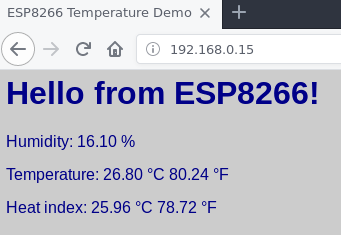
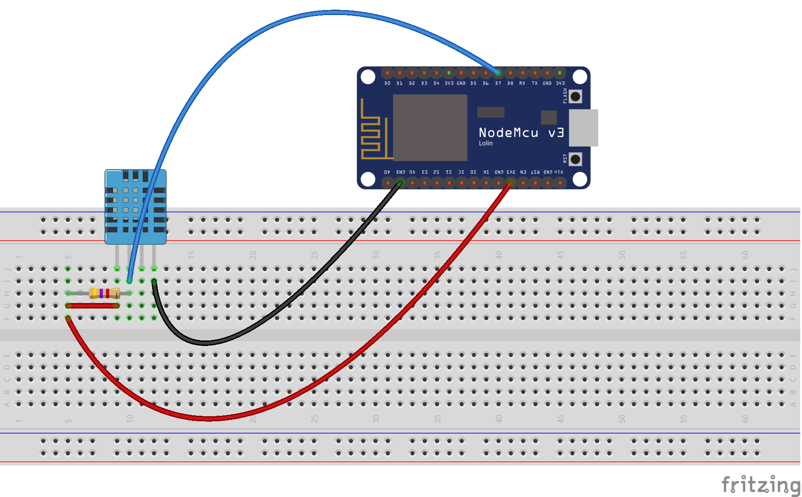

# esp8266-DHT22
Get temperature with wifi using esp8266 and DHT22 module.

To use this code you need to install the [DHT sensor library](https://github.com/adafruit/DHT-sensor-library)

At first you can try to use the DHT sensor without wifi features and just get the temperature by the serial monitor of the Arduino IDE.To do this, use the `DHTtester/` folder.

After this you can use the `simple-server/`

You will need:
* A DHT sensor
* A resistor of 4Ω7
* A ESP-8266
* Some jumping wire